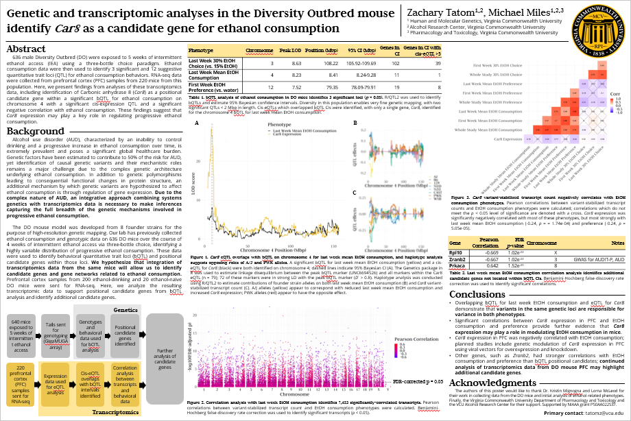

```{r setup, include=FALSE}
knitr::opts_chunk$set(echo = TRUE)
```

## Links

- [Contact Zachary Tatom](mailto:tatomz@vcu.edu)

- [Online Biosketch](http://zacharytatom.github.io/biosketch.html)

- [Download Poster PDF](2022_RSoA_Poster.pdf)

- [Supplemental Figures](supplemental_figures.html)

- [VCU Alcohol Research Center](https://arc.vcu.edu/)

---

## Expanded Abstract

### Background

Genetic factors have consistently been estimated to contribute to 50% of the risk for alcohol use disorder (AUD), yet identifying specific causal variants involved in the mechanisms by which genes impact alcohol consumption remains a challenge. It has been suggested that complex traits such as alcohol consumption are affected by both variants which cause functional changes to protein structure and variants which change protein abundance through regulation of gene expression; a systems genetics approach which integrates both genetic and transcriptomic data is therefore necessary to capture the full breadth of the genetic architecture of AUD. Our lab has previously exposed 636 male Diversity Outbred (DO) to 5 weeks of intermittent ethanol access (IEA) using a three-bottle choice paradigm. DO mice were derived from 8 founder strains displaying high genetic and phenotypic variation, making them suitable for fine genetic mapping (~2-4 Mb). Ethanol consumption data were then used to identify 3 significant and 12 suggestive quantitative trait loci (QTL) for ethanol consumption behaviors.

### Methods

Mice were then exposed to 5 weeks of intermittent ethanol access using a three-bottle choice paradigm, after which time animals were sacrificed and tail samples were genotyped by GigaMUGA microarray (NSNP = 141,090; NCNV = 2,169) and 220 PFC samples were sent out for RNA-seq (150 nt paired-end reads, >30 million reads/sample) and transcript levels were variant stabilized. Cis-expression quantitative trait loci (cis-eQTL) were identified overlapping bQTL intervals using genotype data and variant-stabilized transcript counts (VST). Pearson correlations between VST for individual genes (n = 21,913 genes) and ethanol consumption data were calculated and Benjamini-Hochberg false discovery rate correction was used to identify significant correlations (*p* < 0.05).

### Results

eQTL analysis identified a single gene with a cis-eQTL with a LOD score greater than 5 overlapping the significant behavioral QTL for last week ethanol consumption on chromosome 4. This gene, *Car8*, is one of only 11 genes in the 95% Bayesian CI for the behavioral QTL; it also significantly correlates with several derived ethanol consumption phenotypes, but most highly last week ethanol consumption (-0.24, *p* = 1.74e-04). Additional genes not present within behavioral QTL CIs were identified with even stronger Pearson correlations, such as *Zranb2* which has been associated with AUDIT-P score and AUD diagnosis in meta-analysis of human GWAS.
 
### Conclusions

Integrating transcriptomics data from PFC alongside genetic analyses of DO mice allows for prioritization of positional candidate genes as well as identification of new candidate genes for which expression may play an important role in the mechanisms by which genes impact ethanol consumption. In particular, these findings suggest that *Car8* expression may play a key role in regulating progressive ethanol consumption.

*Supported by NIAAA grant P50AA022537.*

---

## Poster

[](2022_RSoA_Poster.pdf)